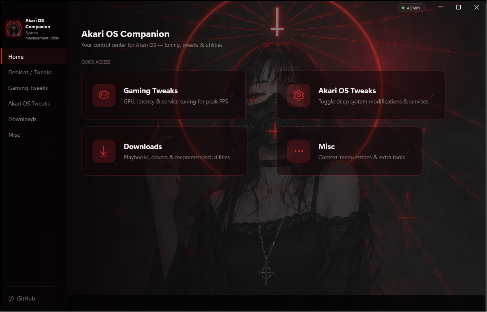

# Akari OS Companion

**Your control center for Akari OS — tuning, tweaks & utilities**

A modern Windows system management utility built with WPF + [WPF-UI](https://github.com/lepoco/wpfui), providing deep OS tweaks, gaming optimizations, debloat tooling, and post-install automation.

---

## ✨ Features

### 🎮 Gaming Tweaks
GPU, latency & service tuning for peak FPS:
- Full suite of gaming-oriented registry toggles
- SvcHost split threshold, Win32 priority separation & service configuration dropdowns
- Quick-access tool grids for **NVIDIA**, **AMD** and useful third-party utilities

### ⚙️ Akari OS Tweaks
Toggle deep system modifications & services:
- 32 OS-level tweaks backed by real registry implementations
- Two-phase **Disable Defender** workflow
- Instant apply with status feedback

### 🧹 Debloat
- 28 PowerShell-backed debloat actions to strip unwanted Windows components and telemetry

### 📥 Downloads
- Playbooks, drivers & recommended utilities in one place
- **Self-healing post-install system**: automatically downloads required `C:\PostInstall\` assets (~30 MB) from GitHub if they're missing — ideal for fresh installs and VM environments

### 🧩 Misc
- 12 context-menu entries to supercharge your right-click menu
- Extra tools and utilities

## 📋 Requirements

- Windows 10 / 11 (x64)
- .NET Desktop Runtime
- **Administrator privileges** (required for registry & service modifications)

## 🚀 Getting Started

1. Download the latest release from the [Releases](https://github.com/isleap9/AkariOS-Companion/releases) page
2. Run `AkariOSCompanion.exe` **as Administrator**
3. The app will automatically fetch any missing post-install assets on first launch

> **Note on antivirus:** Because this tool modifies system settings, disables services, and can disable Windows Defender, some antivirus software may flag it. If Defender quarantines downloaded assets, the app will re-download them automatically.

## 🛠️ Built With

- **C# / .NET** — WPF desktop application
- **[WPF-UI (lepo.co)](https://github.com/lepoco/wpfui)** — Fluent design components
- **PowerShell** — embedded scripts for debloat & tooling actions

## ⚠️ Disclaimer

This tool makes deep modifications to the Windows registry, services, and security features (including Windows Defender). Use at your own risk. Creating a system restore point before applying tweaks is strongly recommended.

## 📄 License

This project is provided as-is. See [LICENSE](LICENSE) for details.
